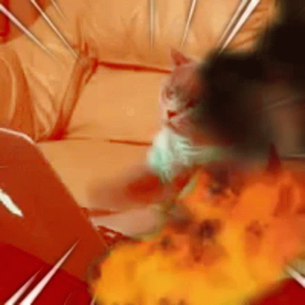

# <h1 align="center">Hey there! </h1>

## About Me:

I am a Back-End Developer from Canada. [More info](https://costcofanboy.github.io/CostcoFanboy/)

- I’m working as a Lead Software Developer, and I'm currently dipping my toes into the wonderful world of Rust.
- Specialized in Python 3 and PHP 7+ Back-End Development and finding the best poutine  in a 10km radius of any location.

## 📫 Contact Me:
  -   
  - 

